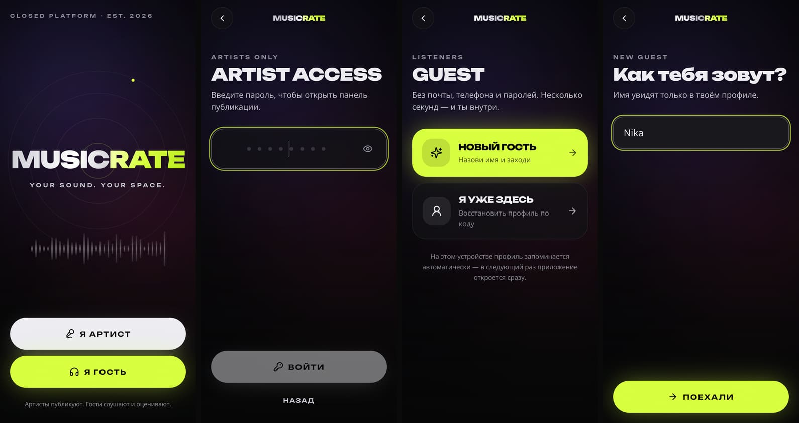
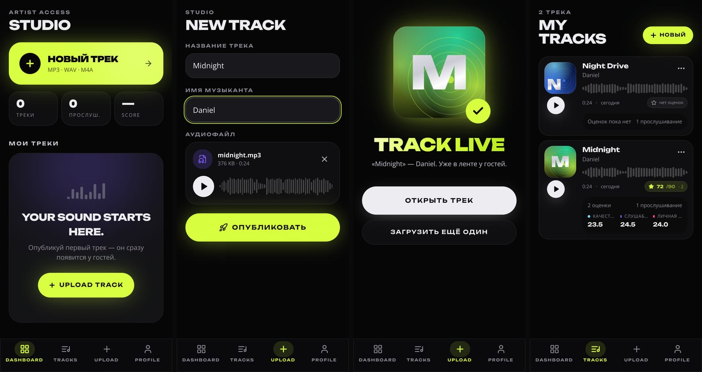
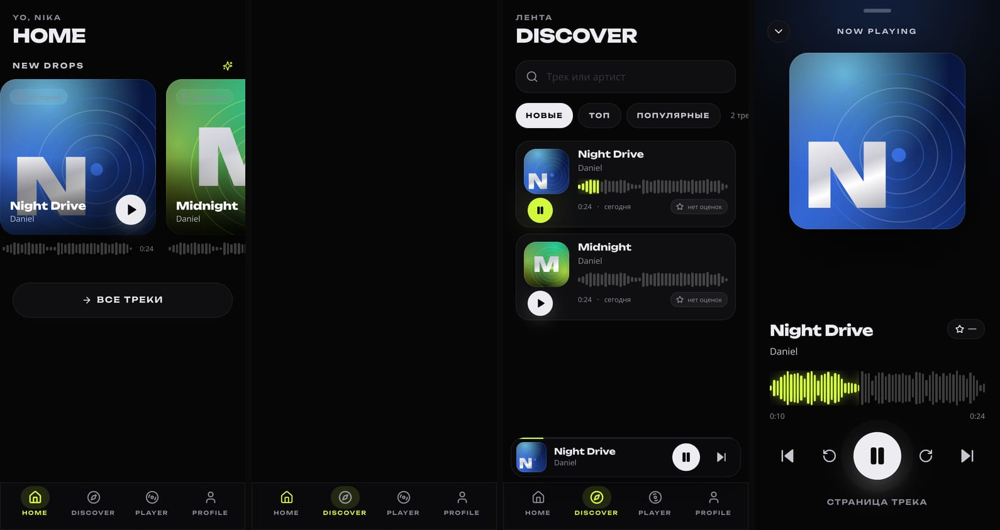
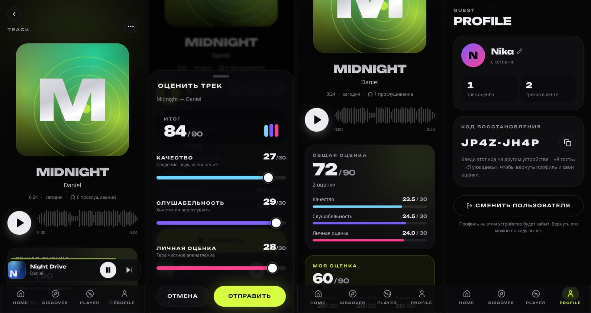
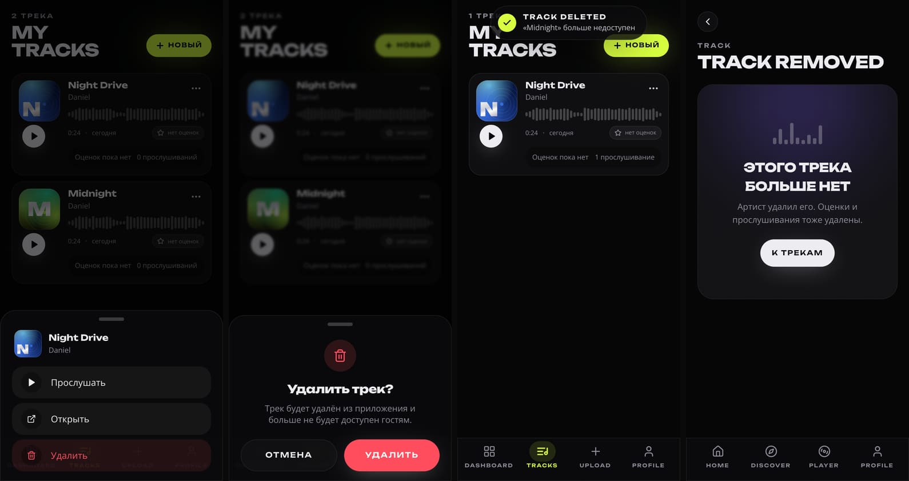

<div align="center">

# MUSICRATE

**YOUR SOUND. YOUR SPACE.**

Закрытая музыкальная платформа для артистов и слушателей.
Артисты публикуют треки по общему коду доступа, гости слушают и ставят публичные оценки по шкале 0–90.

[](https://github.com/karalik19-a11y/musicrate/actions/workflows/ci.yml)


[](https://karalik19-a11y.github.io/musicrate/)



</div>

---

## Что это

MUSICRATE — mobile-first веб-приложение в духе iOS-приложения, а не сайта: тёмный премиальный интерфейс, жесты, шторки, мини-плеер, safe areas под чёлку и Dynamic Island. Внутри — не мокап, а рабочая система: пользователи, сессии, загрузка и стриминг аудио, публичные рейтинги, статистика прослушиваний. Всё переживает перезагрузку страницы и рестарт сервера.

**Приложение открывается просто по ссылке с GitHub Pages** — [karalik19-a11y.github.io/musicrate](https://karalik19-a11y.github.io/musicrate/). Статический хостинг отдаёт тот же клиент, а данные ведёт встроенный движок браузера (см. [Два источника данных](#два-источника-данных)): код артиста, публикация MP3, оценки 0–90 и удаление трека работают без своего сервера. Поднял API — и тот же бандл по той же ссылке пишет в общую базу.

**Две роли, ноль регистрации:**

| | Артист | Гость |
|---|---|---|
| Вход | общий код доступа (`00112233` по умолчанию): на общем бэкенде проверяется **только сервером**, в статическом режиме — локальным движком на устройстве | только имя — профиль создаётся за секунду |
| Может | публиковать MP3 / WAV / M4A, видеть оценки и прослушивания, удалять **свои** треки | слушать, искать, ставить и менять **свою** оценку каждому треку |
| Не может | оценивать треки | загружать и удалять |
| Сессия | запоминается на устройстве; повторный вход по коду с того же устройства возвращает ту же личность и те же треки | запоминается на устройстве; на другом устройстве профиль возвращается по коду восстановления `XXXX-XXXX` |

### Возможности

- **Welcome** — логотип, слоган, анимированный фон (градиент, свечение, «дышащая» волна, зерно), два больших входа «Я артист» / «Я гость».
- **Артист**: `ARTIST ACCESS` → дашборд со статистикой → `+ НОВЫЙ ТРЕК` → загрузка с предпросмотром (имя файла, длительность, waveform, play/pause, прогресс загрузки) → анимация `TRACK LIVE` → `MY TRACKS` с оценкой /90, количеством оценок, прослушиваниями и разбивкой по трём критериям; меню `•••` → Прослушать / Открыть / Удалить с подтверждением и тостом `TRACK DELETED`.
- **Гость**: `HOME` (новые дропы, самые прослушиваемые), `DISCOVER` (поиск, сортировки «Новые / Топ / Популярные»), страница трека, оценка через шторку с тремя слайдерами, профиль с кодом восстановления и «Сменить пользователя».
- **Плеер**: HTML5 Audio, постоянный мини-плеер над таб-баром, полноэкранный плеер с большой обложкой, «живой» waveform с перемоткой по тапу, ±10 секунд, предыдущий/следующий, Media Session (управление с локскрина).
- **Обложки** генерируются детерминированно из seed трека — у каждого трека своя палитра, форма и типографика; никаких загрузок картинок.
- **Рейтинги — публичные всегда**, даже при одной оценке: `ОБЩАЯ ОЦЕНКА N/90 · k оценок` + `КАЧЕСТВО / СЛУШАБЕЛЬНОСТЬ / ЛИЧНАЯ ОЦЕНКА` (среднее /30 с одним знаком). После оценки всё обновляется без перезагрузки: карточка, страница, плеер, кабинет артиста.
- **Два источника данных**: общий API или локальный движок браузера — определяется на старте, переключается в профиле без пересборки (подробнее ниже).
- **Состояния**: скелетоны загрузки, пустые состояния (`NO TRACKS YET · Be the first one to drop.` / `Your sound starts here.`), ошибки сети с кнопкой «Повторить» (кэшированный профиль открывает приложение и офлайн), `TRACK REMOVED` для удалённого трека.
- **Адаптив**: iPhone SE → iPhone 16 Pro Max, Android, планшет, десктоп (центрированная колонка). Ничего не наезжает; учтены `safe-area-inset-*`.

<div align="center">




</div>

---

## Стек

| Слой | Технологии |
|---|---|
| Frontend | React 19, TypeScript, Vite 7, Tailwind CSS v4, react-router 7, TanStack Query 5, Zustand 5, Motion 12, lucide-react, шрифт Unbounded (self-hosted) |
| Backend | Node ≥ 20.19, Express 5, TypeScript, Zod 4, Multer 2, music-metadata, Helmet |
| Данные | один контракт `Backend` и два исполнителя: SQLite через `@libsql/client` + диск на Volume (`server/`) **или** встроенный движок браузера — IndexedDB + Blob-хранилище (`client/src/lib/backend/local.ts`) |
| Общая логика | `shared/types.ts` (контракты) и `shared/scoring.ts` (формула рейтинга) — одни и те же файлы и для сервера, и для офлайн-движка |
| Тесты | Vitest: 24 теста API (Supertest) + 17 тестов клиента, включая сквозной прогон интерфейса в happy-dom |
| Деплой | **GitHub Pages** — статика из `docs/` (бандл в репозитории + workflow `pages.yml`), либо один Node-процесс, отдающий API и клиент: Dockerfile, `docker-compose.yml`, `fly.toml`, `railway.json`, `render.yaml`, GitHub Actions CI |

---

## Структура репозитория

```
musicrate/
├─ client/                 # SPA (Vite + React)
│  └─ src/
│     ├─ components/       # плеер, карточки, шторки, waveform, обложки, таб-бар, ui/*
│     ├─ screens/          # welcome, artist/*, guest/*, Track, Profile
│     ├─ hooks/            # useTracks (React Query: лента, трек, публикация, оценка, удаление)
│     ├─ stores/           # auth (persist), player, toast
│     ├─ lib/              # api-клиент, форматирование, генератор обложек, анализ аудио
│     └─ styles/app.css    # дизайн-система (токены, glass, grain, safe areas)
├─ server/                 # API (Express 5)
│  ├─ src/
│  │  ├─ routes/           # auth, me, tracks, artist
│  │  ├─ repos/            # users, sessions, tracks (+ ratings, plays)
│  │  ├─ storage/          # AudioStorage: локальный диск с Range-стримингом
│  │  ├─ db/               # подключение libsql + схема
│  │  ├─ middleware/       # Bearer-аутентификация, роли
│  │  └─ lib/              # crypto, errors, ratelimit, validate, waveform
│  └─ test/flow.test.ts    # 16 интеграционных тестов сквозного сценария
├─ client/src/lib/backend/ # контракт Backend + http.ts (API) и local.ts (движок устройства), выбор источника — index.ts
├─ shared/                 # types.ts (контракты) и scoring.ts (формула рейтинга для обеих сторон)
├─ scripts/pages-build.mjs # сборка статики для GitHub Pages → docs/ + ленчер в корне
├─ docs/                   # собранный бандл (его и публикует Pages) + скриншоты
├─ index.html · 404.html   # ленчер в корне Pages → ./docs/, сохраняет ?api= и #hash
├─ shared/types.ts         # общие типы и лимиты для клиента и сервера
├─ docs/screenshots/
├─ Dockerfile · docker-compose.yml · fly.toml · railway.json · render.yaml
└─ .env.example
```

---

## Быстрый старт (локально)

Требуется **Node.js ≥ 20.19** (рекомендуется 22) и npm ≥ 10.

```bash
git clone https://github.com/karalik19-a11y/musicrate.git
cd musicrate
npm install          # ставит зависимости обоих workspace'ов
npm run dev          # API на :8080 + Vite dev-сервер на :5173 (с прокси /api → :8080)
```

Откройте <http://localhost:5173>. Код артиста по умолчанию — **`00112233`**.
С телефона в той же сети: `http://<ip-компьютера>:5173` (dev-сервер слушает `0.0.0.0`).

### Production-режим локально

```bash
npm run build        # client → client/dist, server → server/dist
npm start            # один процесс на http://localhost:8080 отдаёт API и клиент
```

### Docker

```bash
docker compose up --build
# или
docker build -t musicrate .
docker run -p 8080:8080 -v musicrate-data:/data -e ARTIST_PASSWORD=свой-код musicrate
```

### Backend и frontend по отдельности

```bash
npm run dev -w server                 # только API (tsx watch), http://localhost:8080
API_URL=http://localhost:8080 npm run dev -w client   # только клиент, /api проксируется на API_URL
```

Другие команды: `npm run typecheck`, `npm test` (тесты API), `npm run build`.

---

## Переменные окружения

Сервер читает `process.env` (см. [`.env.example`](.env.example)). Для локального запуска с файлом: `node --env-file=.env server/dist/index.js`.

| Переменная | По умолчанию | Назначение |
|---|---|---|
| `PORT` | `8080` | порт HTTP-сервера |
| `HOST` | `0.0.0.0` | адрес привязки |
| `ARTIST_PASSWORD` | `00112233` | код доступа артиста; сравнивается на сервере константным по времени сравнением. **Смените в продакшене** (без переопределения сервер пишет предупреждение) |
| `DATA_DIR` | `./data` | каталог для `musicrate.db`, `uploads/` (аудио) и `tmp/` (временные файлы загрузки). В облаке — путь смонтированного volume, например `/data` |
| `DATABASE_URL` | `file:$DATA_DIR/musicrate.db` | libsql-URL; `libsql://…` — удалённая база Turso |
| `DATABASE_AUTH_TOKEN` | — | токен для Turso |
| `MAX_UPLOAD_MB` | `80` | лимит размера аудиофайла |
| `SESSION_TTL_DAYS` | `365` | срок жизни сессии (скользящий — продлевается при использовании) |
| `CLIENT_DIST` | `./client/dist` | путь к собранному клиенту |
| `ALLOWED_ORIGINS` | `*` | источники (origins), которым разрешено обращаться к API из браузера. Нужен, когда статический клиент (GitHub Pages) ходит в API на другом домене; `*` безопасен, так как авторизация — Bearer-заголовок, а не cookie |
| `NODE_ENV` | `development` | `production` включает раздачу клиента с долгим кэшем ассетов |
| `API_URL` | `http://localhost:8080` | только для Vite dev-сервера: куда проксировать `/api` |

Клиент тоже настраивается, но переменные необязательны:

| Переменная (build) | По умолчанию | Назначение |
|---|---|---|
| `VITE_API_URL` | — | адрес API, вшитый в сборку. Не задан → приложение само решит: same-origin `/api/health`, иначе локальный движок |
| `VITE_ARTIST_CODE_HASH` | SHA-256 от `00112233` | только для статического режима: хэш кода доступа, который сверяет локальный движок. Код в бандле не хранится |

Во время `npm run dev` Vite проксирует `/api` на `API_URL` (по умолчанию `http://localhost:8080`).

---

## Два источника данных

Клиент не знает, где лежат данные, — он знает контракт `Backend` (`client/src/lib/backend/types.ts`). На старте (`initBackend()`) выбирается один из двух исполнителей:

| Источник | Когда включается | Где живут треки, профили и оценки |
|---|---|---|
| **`http`** | есть `VITE_API_URL`, либо сохранённый адрес API, либо `/api/health` отвечает с того же домена | SQLite + диск на сервере (`server/`). Публичный рейтинг считается сервером |
| **`local`** | ничего из перечисленного не ответил — например, на GitHub Pages | IndexedDB этого браузера: метаданные, Blob'ы аудио, сессии, оценки, tombstones удалённых треков |

Порядок выбора: `?api=…` в URL (сохраняется в `localStorage`) → `musicrate.apiBase` в `localStorage` → `VITE_API_URL` → same-origin `/api/health` → `local`.

**Локальный режим — не демо-заглушка.** Это ровно те же правила, что у API, только исполняет их движок в браузере: код артиста сверяется с SHA-256-хэшем (plain-кода в бандле нет) с блокировкой после 5 попыток; `publish` доступен только роли `artist`; оценка — только `guest`, ровно одна на пару «трек × пользователь» (ключ `[trackId, userId]`), а `total` считается суммой средних по `shared/scoring.ts`, а не берётся из UI; удаление проверяет владельца (`403 NOT_OWNER`) и стирает файл, оценки и прослушивания, оставляя tombstone, чтобы старая ссылка отвечала `TRACK_DELETED` (410). Данные переживают перезагрузку и закрытие вкладки, а две вкладки синхронизируются через `BroadcastChannel` (React Query инвалидирует кэш).

Чего локальный режим **не** даёт: общая база между устройствами и настоящая защита кода артиста — статический хостинг физически не может ничего скрыть от пользователя. Поэтому для «закрытой площадки» нужен бэкенд: подключи его — и тот же самый интерфейс, без пересборки, начнёт писать в общую базу.

Переключается прямо в приложении: **Профиль → «Источник данных»**. Там же — «Стереть данные устройства» для локального хранилища.

---

## Как работает авторизация

Один механизм для всех: **Bearer-токен сессии**.

1. **Артист.** `POST /api/auth/artist { password, artistKey? }`. Код сравнивается с `ARTIST_PASSWORD` только на сервере (`timingSafeEqual`), эндпоинт ограничен по частоте (12 попыток / 15 минут с IP). При успехе сервер создаёт (или находит) артиста и выдаёт:
   - `token` — 256-битный случайный секрет; в базе хранится только его SHA-256;
   - `artistKey` — секрет устройства. Клиент сохраняет его в `localStorage`; при следующем входе по коду с этого устройства сервер по `artistKey` возвращает **ту же личность** с теми же треками. Так «общий код» не превращается в «общий аккаунт»: каждое устройство — свой артист, и только он может удалять свои треки.
   - Регистрации артистов нет: единственный путь — код.
2. **Гость.** `POST /api/auth/guest { name }` — только имя. Сервер создаёт пользователя с `role: guest`, выдаёт токен и **код восстановления** вида `PJPY-C6GY`. Код показан в профиле; `POST /api/auth/guest/restore { code }` возвращает профиль (и все оценки) на другом устройстве — «Я уже здесь».
3. **Персистентность.** Токен, пользователь и `artistKey` хранятся в `localStorage` (`musicrate.auth.v1`). При старте приложение показывает сплэш, вызывает `GET /api/me` и сразу открывает нужный раздел — без повторного ввода. Сессия скользящая (`SESSION_TTL_DAYS`).
4. **Выход.** `POST /api/auth/logout` отзывает сессию на сервере; клиент очищает токен. У артиста `artistKey` остаётся, чтобы следующий вход по коду вернул его треки; «Сменить пользователя» у гостя забывает профиль на устройстве (вернуть можно по коду).
5. **Права проверяются на сервере**: `requireRole('artist')` для публикации/удаления, `requireRole('guest')` для оценок, `track.artist_id === req.user.id` для удаления (иначе `403 FORBIDDEN`). Фронтенд лишь скрывает недоступные кнопки.

## Как работают загрузки

1. **На клиенте** файл (`.mp3`, `.wav`, `.m4a`; до 80 МБ) декодируется через Web Audio API: считаются длительность и 96 пиков waveform для предпросмотра. Пользователь может прослушать файл до публикации.
2. **Отправка** — `multipart/form-data` (`title`, `artistName`, `waveform`, `audio`) через `XMLHttpRequest` с прогрессом. Multer пишет файл в `DATA_DIR/tmp` (лимит размера, ровно один файл, белый список расширений).
3. **Сервер проверяет содержимое**, а не только расширение: `music-metadata` должен распознать контейнер и длительность, иначе `400 INVALID_AUDIO`. Длительность записывается серверная, пики нормализуются (или генерируются детерминированно, если клиент их не прислал).
4. **Хранение.** Файл атомарно переносится в `DATA_DIR/uploads/<случайный id>.<ext>`; в SQLite создаётся запись трека (`id` — неугадываемый 16-символьный идентификатор, `cover_seed` для обложки, размер, MIME, waveform). При ошибке записи в базу файл удаляется — «сирот» не остаётся.
5. **Воспроизведение** — `GET /api/tracks/:id/audio` со стримингом и поддержкой `Range` (перемотка в Safari/iOS работает нативно). Прослушивание засчитывается один раз за запуск трека (`POST /api/tracks/:id/play`); сервер дополнительно отсекает быстрые повторы.
6. **Удаление** (`DELETE /api/tracks/:id`, только владелец): удаляются файл из хранилища, все оценки и прослушивания; запись трека помечается `deleted_at`, чтобы старые ссылки честно отвечали `410 TRACK_DELETED` — страница показывает `TRACK REMOVED`, плеер останавливается, в ленте, поиске и статистике трека больше нет.

Абстракция `AudioStorage` (`save / delete / send`) позволяет заменить локальный диск на S3/R2 без изменения роутов.

## Как считаются оценки

- Гость ставит три оценки **0–30**: `quality`, `listenability`, `personal`. `PUT /api/tracks/:id/rating` — **upsert** по `(track_id, user_id)`: повторная отправка обновляет запись, дубликатов не бывает.
- После каждой оценки средние по каждому критерию и `total = avgQuality + avgListenability + avgPersonal` (максимум 90) пересчитываются и возвращаются обновлённым треком. Считает их **не интерфейс**, а функция `summarizeRatings()` из [`shared/scoring.ts`](shared/scoring.ts) — её используют и сервер (SQLite отдаёт только суммы), и локальный движок. Нарисовать себе «90/90» правкой во фронтенде нельзя: в ответе всегда то, что следует из реальных строк оценок.
- Рейтинг публичный при любом количестве оценок; количество показывается всегда. Если гость уже оценил трек, он видит и `ОБЩАЯ ОЦЕНКА`, и `МОЯ ОЦЕНКА`.
- Артист оценки ставить не может (`403`), а видит их в реальном времени в `MY TRACKS` и на дашборде (средний балл по каталогу, суммы оценок и прослушиваний).

---

## API

Все ответы — JSON, ошибки в формате `{ "error": "CODE", "message": "человеческое сообщение" }`. Авторизация — заголовок `Authorization: Bearer <token>`.

| Метод и путь | Доступ | Описание |
|---|---|---|
| `GET /api/health` | — | проверка живости |
| `POST /api/auth/artist` | — | `{ password, artistKey? }` → `{ token, user, artistKey }` |
| `POST /api/auth/guest` | — | `{ name }` → `{ token, user }` (с `recoveryCode`) |
| `POST /api/auth/guest/restore` | — | `{ code }` → `{ token, user }` |
| `POST /api/auth/logout` | любой | отзыв сессии |
| `GET /api/me` · `PATCH /api/me` | любой | текущий пользователь · смена имени |
| `GET /api/tracks?sort=new\|top\|played&q=` | публично | лента (без удалённых) |
| `GET /api/tracks/:id` | публично | трек со сводкой рейтинга; `410`, если удалён |
| `GET /api/tracks/:id/audio` | публично | аудио-стрим с `Range`; `410`, если удалён |
| `POST /api/tracks/:id/play` | любой | засчитать прослушивание |
| `PUT /api/tracks/:id/rating` | гость | `{ quality, listenability, personal }` → обновлённый трек |
| `POST /api/tracks` | артист | multipart: `title`, `artistName`, `waveform?`, `audio` |
| `DELETE /api/tracks/:id` | владелец | полное удаление |
| `GET /api/artist/tracks` | артист | свои треки со статистикой |
| `GET /api/artist/overview` | артист | сводка: треки, оценки, прослушивания, средний балл |

---

## Деплой

Приложение — один процесс без внешних сервисов. Нужны две вещи: **переменная `ARTIST_PASSWORD`** и **персистентный диск** для `DATA_DIR` (иначе база и аудио пропадут при перезапуске контейнера).

| Платформа | Как |
|---|---|
| **GitHub Pages (статика, без сервера)** | уже настроено: бандл лежит в `docs/`, Pages публикует `main` из корня, а `index.html` в корне перекидывает в `./docs/`. Обновление — `npm run pages:build` и коммит; workflow [`pages.yml`](.github/workflows/pages.yml) делает это автоматически при пуше в `main`. Данные — в браузере устройства (см. «Два источника данных») |
| **Fly.io** | `fly launch --copy-config --no-deploy` → `fly volumes create musicrate_data --size 1` → `fly secrets set ARTIST_PASSWORD=…` → `fly deploy`. Конфиг: [`fly.toml`](fly.toml) (volume монтируется в `/data`) |
| **Railway** | New Project → Deploy from GitHub. Билд по [`railway.json`](railway.json) (Dockerfile). Добавьте Volume с mount path `/data` и переменные `DATA_DIR=/data`, `ARTIST_PASSWORD` |
| **Render** | New → Blueprint → репозиторий. [`render.yaml`](render.yaml) описывает web-сервис с диском в `/var/data`. Задайте `ARTIST_PASSWORD` в дашборде (на free-плане дисков нет — данные не переживут рестарт) |
| **Любой VPS / Docker** | `docker compose up -d --build` (volume `musicrate-data`) или `npm ci && npm run build && NODE_ENV=production ARTIST_PASSWORD=… DATA_DIR=/srv/musicrate npm start` за nginx/Caddy с HTTPS |
| **Turso вместо файла** | задайте `DATABASE_URL=libsql://…` и `DATABASE_AUTH_TOKEN`; аудио по-прежнему хранится в `DATA_DIR/uploads` |

### GitHub Pages: как это устроено

Pages в этом репозитории опубликован в режиме «ветка → корень», то есть сервера сборки нет. Поэтому:

1. `npm run pages:build` собирает клиент с `base: './'` (`PAGES=1`) и укладывает результат в `docs/`; в корень кладётся ленчер `index.html`/`404.html` и `.nojekyll` (Jekyll не должен трогать бандл).
2. Workflow [`pages.yml`](.github/workflows/pages.yml) на пуше в `main` пересобирает бандл и, если он изменился, коммитит его обратно — ссылка всегда актуальна. В CI (`ci.yml`) есть проверка, что `docs/` совпадает с клиентом, поэтому устаревший бандл не уедет в merge.
3. Роутинг — **hash-router** (`#/track/abc`), а все пути в HTML относительные. Deep-link переживает refresh и работает с любого под-пути, даже с `file://`.
4. При старте приложение пробует `GET /api/health` на своём домене; не ответил — включает локальный движок. Хотите общую базу по той же Pages-ссылке: **Профиль → Источник данных → подключить API** (или `?api=https://…`), ничего пересобирать не нужно. На стороне API достаточно, чтобы `ALLOWED_ORIGINS` включал домен Pages (по умолчанию `*`) — preflight и `Range` для `<audio>` сервер отвечает сам.
5. Тот же бандл доступен как PWA (иконки, `manifest.webmanifest`, standalone, `viewport-fit=cover`) — на iPhone добавляется на домашний экран и открывается без адресной строки.

HTTPS обязателен для Media Session и автозапуска аудио на iOS — все перечисленные платформы выдают его автоматически. Сервер работает за reverse-proxy (`trust proxy` включён), поэтому rate-limit считает реальные IP.

---

## Проверка

- `npm test` — 41 тест из двух сюит:
  - **24 на сервере** (`server/test/`): неверный/верный код, изоляция артистов по `artistKey`, публикация и валидация аудио, оценки (upsert, пересчёт, запрет артисту), удаление только владельцем, `410` для удалённого трека, восстановление гостя по коду + 8 тестов `shared/scoring.ts` (включая «90 из 90 только при единогласном максимуме» и совпадение округлений);
  - **17 на клиенте** (`client/test/`): движок локального хранилища на `fake-indexeddb` (сессии, публикация, one-rating-per-user, tombstones, удаление вместе с файлом) и сквозной прогон UI в happy-dom — старт → `ARTIST ACCESS` → загрузка MP3 → `TRACK LIVE` → перезагрузка приложения (сессия и трек на месте) → новый гость → воспроизведение → `27+29+28 = 84/90 · 1 оценка` → тот же балл в кабинете артиста → удаление → `TRACK DELETED`, аудио/оценки/прослушивания стёрты, мёртвая ссылка объясняет себя.
- Сквозной сценарий в headless Chromium (390×844, 375×667, 320×568, 1440×900): welcome → артист → `00112233` → пустой дашборд → загрузка MP3 и WAV → `TRACK LIVE` → `MY TRACKS` → выход → новый гость → лента → воспроизведение (время идёт, полный плеер) → страница трека → оценка `27 + 29 + 28 = 84/90 · 1 оценка` → перезагрузка (сессия сохранена) → изменение оценки (счётчик остаётся 1) → второй гость видит `84/90`, оценивает → `72/90 · 2 оценки` → восстановление первого гостя по коду → повторный вход артиста возвращает те же треки и показывает `72/90 · 2` → удаление → `TRACK DELETED`, у гостя `TRACK REMOVED`, аудио отвечает `410`, трека нет в ленте → отсутствие горизонтального переполнения на 320px.

## Безопасность — коротко

- Секреты (токены сессий, `artistKey`) хранятся в базе только в виде SHA-256; сравнение кода — константное по времени; лимиты частоты на чувствительных эндпоинтах.
- Загрузки проверяются по содержимому, имена файлов на диске генерируются сервером, лимит размера — на уровне Multer.
- Helmet-заголовки, `X-Content-Type-Options: nosniff` на аудио, `Cache-Control: no-store` на API, идентификаторы треков и пользователей неугадываемые.
- Все проверки прав — на сервере (или в локальном движке, когда сервера физически нет); клиентские проверки только для UX.
- Статический режим: `00112233` не лежит в бандле — там только SHA-256-хэш и блокировка после 5 попыток. Это честная граница «закрытой площадки» внутри устройства, но не защита от владельца устройства: для реального общего доступа поднимите API и укажите его в «Источнике данных».
